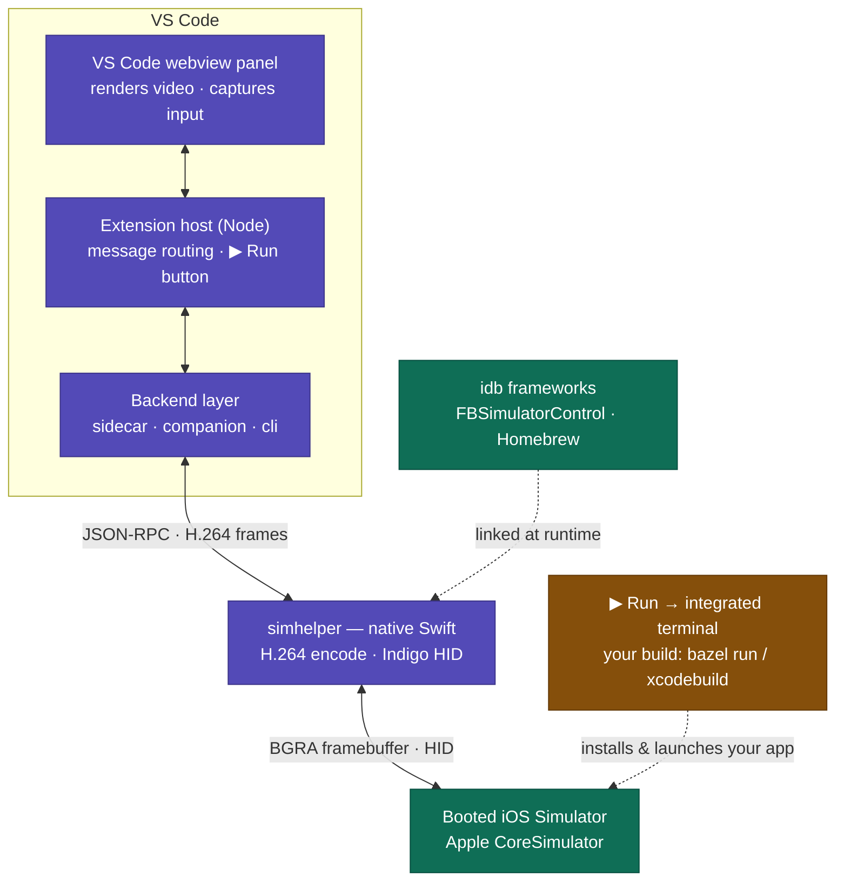

# Sidesim

An embedded iOS Simulator panel for VS Code: a live video mirror of a booted
simulator with click/tap and keyboard input, streamed into a webview.


## Getting started

### 1. Install it — once per machine

```bash
git clone https://github.com/professor-beep-boop/sidesim.git
cd sidesim && ./install.sh
```

`install.sh` checks your prerequisites (macOS, Xcode, Node, Homebrew), installs
Meta's idb-companion if it's missing, builds the extension, and installs it into
VS Code. Reload VS Code when it finishes.

*Don't want to build from source? Grab a `.vsix` from
[Releases](https://github.com/professor-beep-boop/sidesim/releases), or use the
Homebrew tap — see [Install](#install) for every option.*

### 2. Use it — in any project

1. **Boot a simulator** — `xcrun simctl boot "iPhone 17"`, or launch one from
   Xcode or Simulator.app.
2. **Run your app on it** — build and launch however you normally do (Xcode,
   `bazel run …`, `xcrun simctl install`/`launch …`). Sidesim mirrors whatever's
   on the simulator — it doesn't need to know anything about your project.
3. **Open the panel** — in VS Code, open the Command Palette (⇧⌘P) and run
   **iOS Simulator: Open Panel**. Click and type into the mirror; hold **⌥
   Option** and drag to pinch-zoom.

### 3. Optional: rebuild from the panel

Point `sidesim.run.command` at your build command and the panel's **▶ Run**
button builds, installs, and launches on the mirrored device — no toolchain
lock-in (Bazel, Xcode, anything):

```jsonc
// .vscode/settings.json
"sidesim.run.command": "bazel run //path/to:MyApp"
```

Details and more examples under [Build & run](#build--run-your-app).

## Features

- **iOS Simulator: Open Panel** command — mirrors a booted simulator and
  forwards clicks, drags, and keystrokes into it.
- **▶ Run** button — build & launch your app on the mirrored device via a
  command you configure (build-system-agnostic).
- **Two-finger pinch & rotate** on the `sidecar` backend: hold **⌥ Option** and drag (two fingers symmetric about the screen centre, like the iOS Simulator app).
- Three connection backends (see below).

## Architecture

Sidesim is a thin viewer/input layer over a **booted** simulator. Video frames
flow up the pipeline; taps and keystrokes flow down; your build is a side
channel that never passes through Sidesim.



The diagram shows the default **`sidecar`** pipeline (native `simhelper`, best
quality). The `companion` and `cli` fallbacks don't go through `simhelper` —
they reach the simulator through `idb_companion` / the `idb` CLI directly. See
[Backends](#backends) for all three, and [Video pipeline](#video-pipeline) for
why video streams the way it does.

## Build & run your app

Sidesim mirrors a **booted** simulator — it doesn't build or launch your app,
which is exactly why it's build-system-agnostic. The panel's **▶ Run** button
runs a command *you* configure, in a dedicated terminal at the workspace root,
with the target device's UDID exported as `$SIDESIM_TARGET_UDID`:

- **Bazel** (rules_apple): `bazel run //path/to:MyApp`
- **Bazel, exact device:** `bazel build //app:MyApp && xcrun simctl install "$SIDESIM_TARGET_UDID" bazel-bin/app/MyApp.app && xcrun simctl launch "$SIDESIM_TARGET_UDID" com.example.MyApp`
- **Xcode:** `xcodebuild -scheme MyApp -destination "id=$SIDESIM_TARGET_UDID" && xcrun simctl launch "$SIDESIM_TARGET_UDID" com.example.MyApp`

Boot a simulator, open the panel, click ▶ Run, and the mirror reflects each
rebuild live. (`bazel run` chooses its own simulator; to pin it to the mirrored
device, use the explicit `simctl` form with `$SIDESIM_TARGET_UDID`.)

Haven't set a command yet? Clicking ▶ Run offers a starter template for the
build system it detects in your workspace (Bazel or Xcode) — pick one, replace
the placeholder, and run.

## Video pipeline

The `companion` backend streams **raw BGRA frames** (idb `RBGA` format) and
draws them to a `<canvas>` with `putImageData`. This is deliberate: the
simulator's H.264 encoder produces an effectively infinite GOP (one keyframe)
*with B-frames*, so under motion a single dropped/late frame breaks the
reference chain and every decoder — WebCodecs or ffmpeg alike — smears the
picture permanently. Raw frames are intra-only, so they can't smear and hold a
steady frame rate under motion. Frames are streamed at half resolution to keep
the raw bandwidth reasonable; the renderer derives the stride-padded row length
from each frame's byte length.

The `cli` backend still delivers H.264, which the webview decodes with
**WebCodecs** (`VideoDecoder`) — usable for light motion but subject to the
smearing above.

## Requirements

- macOS with Xcode and at least one **booted** iOS Simulator.
- **VS Code, or a VS Code fork.** Sidesim uses only stable extension APIs, so it
  runs anywhere with a VS Code ≥ 1.90 extension host. Verified: **VS Code** and
  **Cursor** (VS Code base 1.99, full `sidecar` backend with live H.264);
  VSCodium and Windsurf should work the same way. `install.sh` finds VS Code,
  Cursor, and VSCodium automatically; for any other fork, pass
  `--editor <cli>`.
- Meta's [`idb_companion`](https://fbidb.io) — `install.sh` sets this up for
  you; to do it by hand: `brew install facebook/fb/idb-companion` (add
  `pipx install fb-idb` only if you want the fallback `cli` backend).

## Backends

The panel can talk to a simulator three ways, selected by
`sidesim.simulator.backend`:

| Value | How it works | Trade-off |
| --- | --- | --- |
| `auto` (default) | Prefer `sidecar`, then `companion`, then `cli` | Best available |
| `sidecar` | Native `simhelper` process (see `sidecar/`): full-resolution H.264 encoded correctly (no B-frames, 2s keyframes) + in-process HID including native text | Best quality and latency; needs `swift build` in `sidecar/` |
| `companion` | Persistent gRPC connection to `idb_companion` — framebuffer H.264 video and a held-open HID input stream | Low latency; taps are instant |
| `cli` | `idb video-stream` for video, one `idb ui …` process per input event | Simple; ~0.5s per-tap latency |

The `companion` backend launches one `idb_companion` per open panel
(`--grpc-port 0`, auto-assigned) and disposes it when the panel closes. Text
entry is delegated to `idb ui text` on both backends so character→keycode
mapping stays correct.

## Running (development)

1. `npm install`
2. `cd sidecar && swift build` (builds the native sidecar for the `sidecar`
   backend; skip it to develop against the `companion`/`cli` backends)
3. Open this folder in VS Code
4. Press `F5` to launch an Extension Development Host
5. Boot a simulator, then run **iOS Simulator: Open Panel** from the Command
   Palette

## Install

### From source (recommended)

The one-command install from [Getting started](#getting-started), with its
options spelled out:

```bash
git clone https://github.com/professor-beep-boop/sidesim.git
cd sidesim && ./install.sh
```

`install.sh` checks the prerequisites (macOS, Xcode, Node, Homebrew), offers to
install idb-companion if it's missing, builds everything, and installs the
packaged extension into VS Code (or `--editor codium|cursor`; it prefers VS
Code even when `code` isn't on your PATH). Because the sidecar is compiled
locally it carries no quarantine attribute, so Gatekeeper never prompts.
`./install.sh --uninstall` removes it.

### Prebuilt VSIX + Homebrew

Don't want to build the extension? Download a `.vsix` from
[Releases](https://github.com/professor-beep-boop/sidesim/releases) (each
release lists its install steps), and get the native sidecar from the
[Homebrew tap](https://github.com/professor-beep-boop/homebrew-sidesim), which
also pulls in the idb-companion frameworks automatically:

```bash
brew install professor-beep-boop/sidesim/simhelper
```

Precedence note: a release VSIX bundles its own version-matched sidecar, which
the extension prefers; the brew binary serves builds without a bundled one
(e.g. a future Marketplace VSIX), or set
`SIDESIM_SIMHELPER="$(brew --prefix)/bin/simhelper"` to use it explicitly —
then `brew upgrade` keeps the native side current.

## Packaging & installing (manual)

```bash
npm run package        # builds a universal simhelper + produces sidesim-*.vsix
code --install-extension sidesim-*.vsix
```

`npm run package` compiles the extension, builds `sidecar/simhelper` as a
**universal** binary (arm64 + x86_64), ad-hoc signs it, stages it at
`bin/simhelper`, and bundles everything into the VSIX.

**Prerequisite on the target machine:** `brew install facebook/fb/idb-companion`. The
sidecar is **not** bundled with the FBSimulatorControl frameworks — it links
against the Homebrew bottle at runtime (rpaths cover both `/opt/homebrew` and
`/usr/local`). Without it, the extension falls back to the `companion`/`cli`
backends. `pipx install fb-idb` additionally enables the `cli` backend.

If you download a prebuilt VSIX (rather than building locally), macOS may
quarantine the sidecar binary; clear it with
`xattr -dr com.apple.quarantine <installed-extension-path>/bin/simhelper`.

## License & disclaimers

MIT — see [LICENSE](LICENSE). Contributions welcome: see
[CONTRIBUTING.md](CONTRIBUTING.md); security reports: see
[SECURITY.md](SECURITY.md).

The extension icon is composed from the 📱 and ▶️ glyphs in
[Microsoft Fluent Emoji](https://github.com/microsoft/fluentui-emoji) (the
phone lightened for contrast against the backplate), used under the MIT
License — copyright (c) Microsoft Corporation; full notice in
[licenses/fluentui-emoji-LICENSE.txt](licenses/fluentui-emoji-LICENSE.txt).

This project is not affiliated with, endorsed by, or sponsored by Microsoft,
Apple, or Meta. "Visual Studio Code", "iOS", "Xcode", and "iPhone" are
trademarks of their respective owners. The sidecar drives the simulator
through Meta's open-source [idb](https://fbidb.io) frameworks (MIT), which in
turn use private Apple CoreSimulator APIs — standard for local developer
tooling, but this is not App Store material and a major Xcode update can
break it until idb catches up.
